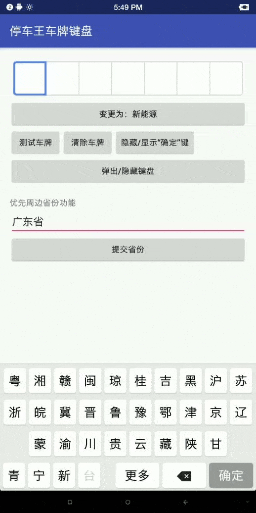
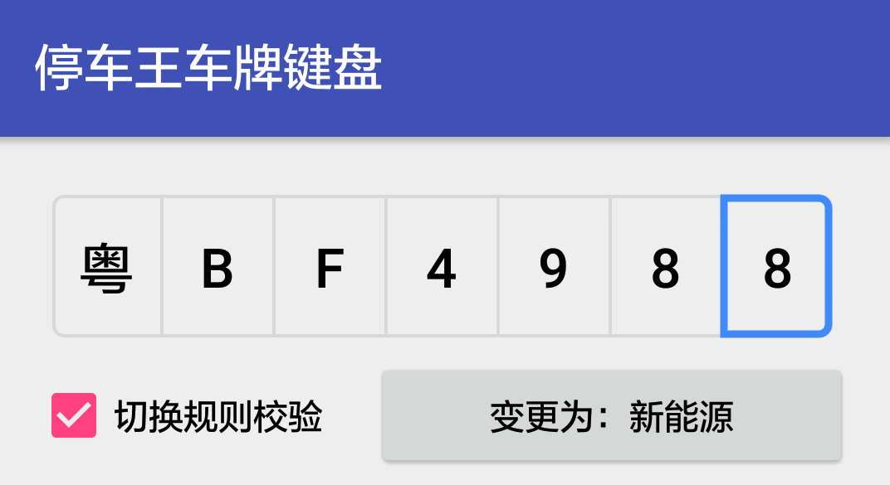
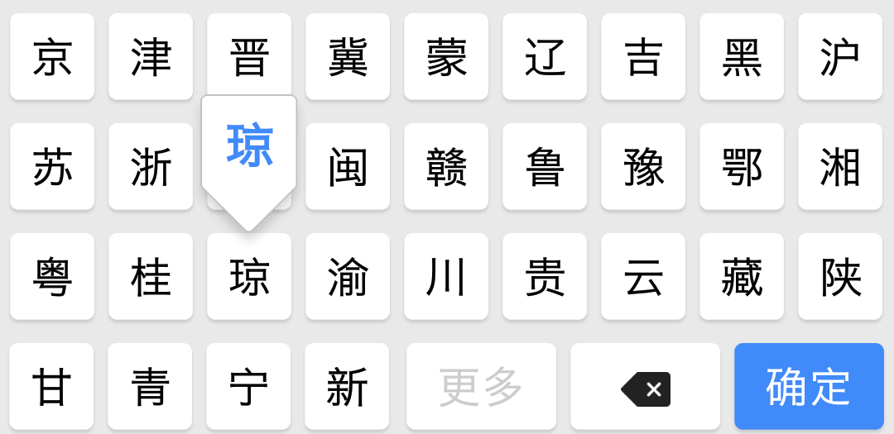
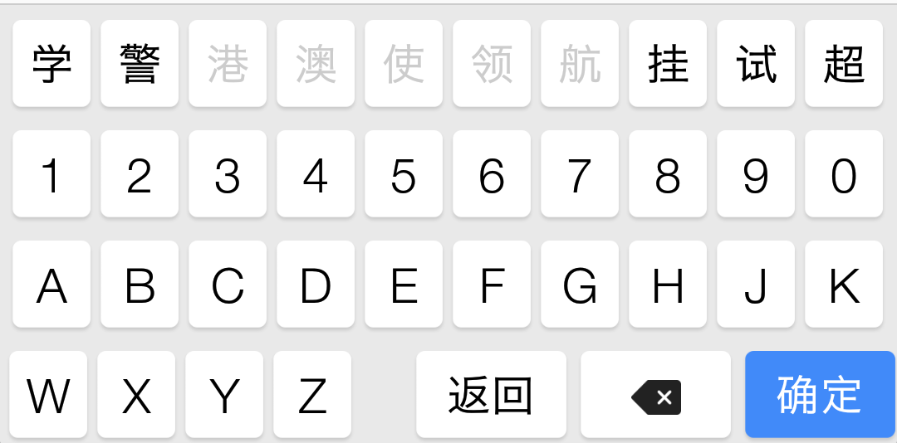
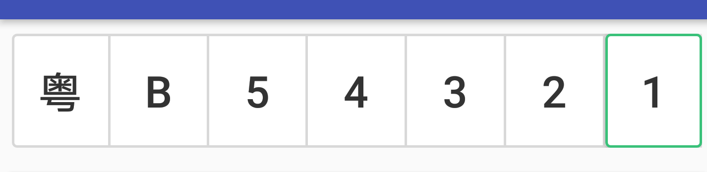
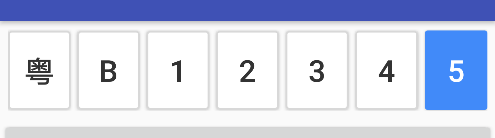
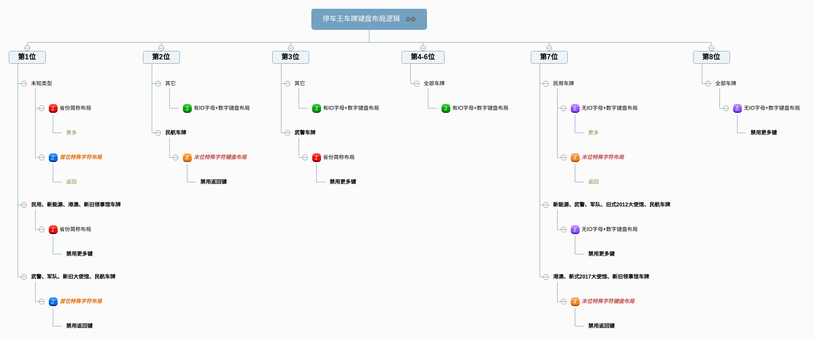

# 停车王车牌键盘 VehicleKeyboard - Android

`VehicleKeyboard`是停车王品牌的各端产品线的基础组件，专为提高中国车牌号码输入速度而定制开发的专用键盘组件。
为停车行业的用户输入车牌号码，提供非常便捷有效的输入方式。

包括以下三个项目：

- `Android` Android项目，为Android客户端定制包括输入组件、键盘组件及相关控制逻辑实现；
- `iOS` iOS客户端项目，为iOS客户端定制包括输入组件、键盘组件及相关控制逻辑实现；
- `JavaScript(Vue.js)` JavaScript(Vue.js)项目，为H5页面定制，包括Web、微信、支付宝等，同样包括输入组件、键盘组件及相关控制逻辑实现

## 零、项目主页

### Android 版本
- [GitHub项目主页](https://github.com/parkingwang/vehicle-keyboard-android)
- [OSChina项目主页](https://gitee.com/iRainIoT/vehicle-keyboard-android)

### iOS 版本
- [GitHub项目主页](https://github.com/parkingwang/vehicle-keyboard-ios)
- [OSChina项目主页](https://gitee.com/iRainIoT/vehicle-keyboard-ios)

### JavaScript Vue.js 版本
- [GitHub项目主页](https://github.com/parkingwang/vehicle-keyboard-js)
- [OSChina项目主页](https://gitee.com/iRainIoT/vehicle-keyboard-js)

### 兼容性声明

**注意：**
当前版本v0.5，已修改为Java原生实现键盘逻辑，不再使用Javascript。项目包结构已发生重大修改，不再向0.4及以下版本兼容。



### 支持输入车牌类型

支持中华人民共和国现行绝大部分车牌号码类型：

1. 民用蓝牌、黄牌；
2. 新能源车牌；
3. 港澳车牌；
4. 武警车牌；
5. 军队车牌；
6. 新旧大使馆车牌；
7. 新旧领事馆车牌；
8. 民航车牌；

## 一、添加到项目

增加仓库地址：

```groovy
repositories {
    jcenter()
}
```

添加库依赖：

```groovy
implementation 'com.parkingwang:keyboard:0.7.3'
// OR
compile 'com.parkingwang:keyboard:0.7.3'
```

## 二、使用组件

**注意：**有问题请先查看 [FAQ][1] 及搜索 [issue][2]。

### 2.1 车牌号码输入组件 InputView



InputView是用于手动输入车牌的组件，提供7-8个用户可选择修改的输入框，如上图所示。

在XML中放置输入组件：

```xml

    <com.parkingwang.keyboard.view.InputView
        android:id="@+id/input_view"
        app:pwkInputTextSize="22sp"
        android:layout_width="match_parent"
        android:layout_height="60dp"/>

```

### 2.2 车牌号码键盘组件 - KeyboardView




KeyboardView是车牌输入键盘组件，提供按车牌类型显示一定规则的键盘布局供用户点击，如上图所示。

在XML中放置键盘组件：

```xml
    <com.parkingwang.keyboard.view.InputView
            android:id="@+id/input_view"
            android:layout_margin="6dp"
            app:pwkInputTextSize="22sp"
            android:layout_width="match_parent"
            android:layout_height="60dp"/>
```

### 2.3 输入框和键盘控制器 - KeyboardInputController

在代码中绑定输入组件与键盘的关联：

**使用弹出键盘**

详见 MainActivity 的演示代码。见地址：[](./app/src/main/java/com/parkingwang/vehiclekeyboard/demo/MainActivity.java)

```java
// Init Views

// 创建弹出键盘
mPopupKeyboard = new PopupKeyboard(this);
// 弹出键盘内部包含一个KeyboardView，在此绑定输入两者关联。
mPopupKeyboard.attach(mInputView, this);

// KeyboardInputController提供一个默认实现的新能源车牌锁定按钮
mPopupKeyboard.getController()
        .setDebugEnabled(true)
        .bindLockTypeProxy(new KeyboardInputController.ButtonProxyImpl(lockTypeButton) {
            @Override
            public void onNumberTypeChanged(boolean isNewEnergyType) {
                super.onNumberTypeChanged(isNewEnergyType);
                if (isNewEnergyType) {
                    lockTypeButton.setTextColor(getResources().getColor(android.R.color.holo_green_light));
                } else {
                    lockTypeButton.setTextColor(getResources().getColor(android.R.color.black));
                }
            }
        });
```

**不弹出键盘，直接显示**

```java

// 使用 KeyboardInputController 来关联
mController = KeyboardInputController
                    .with(mKeyboardView, inputView);

mController.useDefaultMessageHandler();
```

**切换新能源和普通车牌是否校验**

```java
mController.setSwitchVerify(false) //不校验（默认校验）
```

## 三、键盘功能特性设置

### 3.1 设置是否显示“确定”键

根据需要，你可以通过调用KeyboardEngine的`setHideOKKey(boolean)`来设置是否隐藏“确定”键。

```java
mPopupKeyboard.getKeyboardEngine().setHideOKKey(mHideOKKey);
```

### 3.2 优先显示周边省份

根据需要，在不同地区的用户，输入车牌号码时，可以根据当地地理位置，显示周边省份的简称。
获取地理位置需要的定位功能，需要你外部调用定位API，获取到对应的省份名称后，设置到KeyboardEngine中。
使用如下代码：

```java
mPopupKeyboard.getKeyboardEngine().setLocalProvinceName("广东省");
```

### 3.3 设置键盘按下时的气泡：

1. 正确地显示气泡

由于顶层按键的气泡会显示到键盘之外，因此需要键盘所在的父布局增加以下属性（如果气泡范围超出父布局，则需往上递归设置）：

```xml
    android:clipChildren="false"
```

2. 不显示气泡

```java
    mKeyboardView.setShowBubble(false);
```


## 四、键盘样式设置

### 4.1 设置键盘按钮文字大小

在Java代码中添加以下设置：
```java
    mKeyboardView.setCNTextSize(float); //设置中文字体大小
    mKeyboardView.setENTextSize(float); //设置英文字母或数字字体大小
```

### 4.2 设置键盘主题颜色

在colors.xml中覆盖以下颜色值以修改键盘主题色
```xml
    <color name="pwk_primary_color">#418AF9</color>
    <!--确定按键按下时的颜色-->
    <color name="pwk_primary_dark_color">#3A7CE0</color>
```
### 4.3 设置输入组件字体大小：

```xml
    <com.parkingwang.keyboard.view.InputView
            app:pwkInputTextSize="22sp"
            ..../>
```

### 4.4 设置输入组件的样式

默认提供两种输入组件样式：

#### 4.4.1. 混合紧排样式（默认样式） - MIXED



```xml
    <!--输入框按键样式，最左最右键样式设置-->
    <style name="PWKInputItemStyleKey" parent="PWKInputItemStyle_BORDER_KEY"/>
    <!--输入框外部样式-->
    <style name="PWKInputViewStyle" parent="PWKInputViewStyle_MIXED"/>
```

#### 4.4.2. 分隔块状样式 - DIVIDED



```xml
    <!--输入框按键样式，最左最右键样式设置-->
    <style name="PWKInputItemStyleKey" parent="PWKInputItemStyle_FILLED_KEY"/>
    <!--输入框外部样式-->
    <style name="PWKInputViewStyle" parent="PWKInputViewStyle_DIVIDED"/>

```

在项目的`styles.xml`中覆盖设置以上两种样式配置，可以切换显示不同的样式。可参考 App 的配置代码。

### 4.5 如何修改自己的样式

覆盖`PWKInputItemStyleKey / PWKInputItemStyleLeft / PWKInputItemStyleRight`和`PWKInputViewStyle`来实现。

- `PWKInputItemStyleKey` 控制输入组件内每个输入框的按键Button样式，样式作用于每个Button；
- `PWKInputViewStyle` 控制输入组件的整体样式，作用于LinearLayout；

#### 4.5.1 InputView的样式选项

**注意**
最新版本需要配置 `InputView` 的 `style`。配置方法有以下两种：

在布局文件中为 `InputView` 添加以下属性：

```
    style="@style/PWKInputViewStyle"
```
或者是在 `Application` 或 `Activity` 所配置的 `theme` 的 `style` 中添加配置（参考 demo 项目）：

```
    <item name="pwkInputStyle">@style/PWKInputViewStyle</item>
```

**常规配置**

通过覆盖以下样式配置，可以修改默认样式

```xml

    <!--输入框外边框宽度-->
    <dimen name="pwk_input_view_border_width">0.7pt</dimen>
    <!--背景缩进，必须与pwk_input_view_border_width保持一致，并且为负值-->
    <dimen name="pwk_input_view_border_width_inset">-0.7pt</dimen>
    <!--输入框分割线的宽度，在混合组件中使用-->
    <dimen name="pwk_input_view_divider_split_line">@dimen/pwk_input_view_border_width</dimen>
    <!--输入框分割空间的距离，在分离组件样式中使用-->
    <dimen name="pwk_input_view_divider_split_space">5dp</dimen>
    <!--输入框选中状态的边框宽度，在混合组件中使用-->
    <dimen name="pwk_input_item_highlight_border_width">1.2pt</dimen>
    <!--输入框圆角-->
    <dimen name="pwk_input_item_radius">4dp</dimen>
    <!--输入框字体大小-->
    <dimen name="pwk_input_item_text_size">24sp</dimen>

```

### 4.5.2 如何自定义输入框的选中样式

1. 继承 `SelectedDrawable` 并重写 `public void draw(@NonNull Canvas canvas)` 方法自己绘制选中效果。
2. 然后将该类配置到 `InputView` 的 `app:pwkSelectedDrawable` 属性或其 `style` 中，如下所示：

```
    <item name="pwkSelectedDrawable">com.parkingwang.keyboard.view.SelectedDrawable</item>
```

## 五、停车王车牌键盘布局切换逻辑

### 5.1 DOC文档

[DOC文档](https://parkingwang.github.io/vehicle-keyboard-android/)

### 5.2 停车王车牌键盘布局切换逻辑

停车王车牌键盘布局切换逻辑的思维导图，说明了当前版本的键盘布局的切换，以及“更多”、“返回”按钮的切换逻辑。



[百度脑图地址](http://naotu.baidu.com/file/3f07c764a7a4e6b146a827ec56b9a059?token=9ea43f483a785175)

## 六、版本更新

### v0.7.4 2019.11.27

- 修改新能源车牌号输入及校验规则

### v0.7.3 2019.3.25

- 添加了新能源和普通车牌是否需要规则校验控制选项

### v0.7.1 2018.11.05

- 兼容 Android P 导航栏

### v0.7 2018.09.19

- 增加动态设置气泡、按键主题色的方法

### v0.6.1 2018.08.02

- 修复在4.4.2上选择框位置不正确的问题

### v0.6.0 2018.07.24

- 重写选中样式的实现，使用更灵活的 Drawable 类来实现绘制选中样式，并解决原来设置背景来实现选中样式的局限。
- 修改 InputView 的布局，去掉原来为实现选中样式而另外添加的一个 Button。
- pwk_input_view 根标签改为 <merge></merge>，减少层级。注意：此修改将影响使用配置，相关说明见 README.md 的第 4.5.1 条“InputView 的样式选项”一节。
- 原来对输入位是否显示的判断由 isShown() 改为 getVisibility() == View.VISIBLE，以解决在界面未显示时判断不正确的问题。
- Fixes #19

### v0.5.5 2018.07.02

- 移除HK_MACAO车牌类型；
- 仅当车牌"粤"字头时，才可以选择"港澳"汉字；

### v0.5.3 2018.06.15

> 说明：在此版本中，发生架构和项目结构的重大修改，不向下兼容，请按照当前版本的使用说明来修改；

- 使用Java原生键盘引擎，替代原JavaScript。
- 删除KeyboardType类型，不再需要配置键盘类型，本版本支持所有类型车牌；
- 增加全类型车牌支持，增加“更多”和“返回”来切换键盘布局；
- 优化InputView内部逻辑，简化其实现代码；
- 优化整体操作性能，键盘输入更多流畅了；
- 增加周边省份功能设定；

### v0.4.0 2018.0424

> 说明：在此版本中，如果使用`com.parkingwang.keyboard.support.KeyboardInputController`包的相关类，
> 会报告Deprecated,使用`com.parkingwang.keyboard.KeyboardInputController`包的类即可。

- 更新KeyboardInputController及相关类的包结构；
- 增加Controller各个Set和Add接口的NullPointer检查；

### v0.3-ALPHA 2017.1120

- 修复Texts关于字符判断的问题；
- 更新Gradle版本为3.3.0；
- 更新JS文件(JS压缩)；
- 全键盘模式下，增加“民航”车牌类型；
- 修改KeyboardView每行键位数的基准为第一行；

### v0.2-ALPHA 2017.1113

- 修改键盘组件主题颜色的控制逻辑，原有的`pwk_keyboard_primary_color`修改为`pwk_primary_color`，并作为整个键盘的主题色。
- 为输入框不同键位的增加控制主题。`PWKInputItemStyleKey / PWKInputItemStyleLeft / PWKInputItemStyleRight`。

### v0.1-BETA 2017.1108

- 完成基础功能，更新文档并公开发布；

## Contributors

[VehicleKeyboard-Android](https://github.com/parkingwang/vehicle-keyboard-android)
由西安艾润物联网技术服务有限公司第一事业部深圳研发中心开发和维护，旨在与停车行业同行进行技术交流和分享。

## 疑问与交流

[1]: https://github.com/parkingwang/vehicle-keyboard-android/blob/master/FAQ.md
[2]: https://github.com/parkingwang/vehicle-keyboard-android/issues
