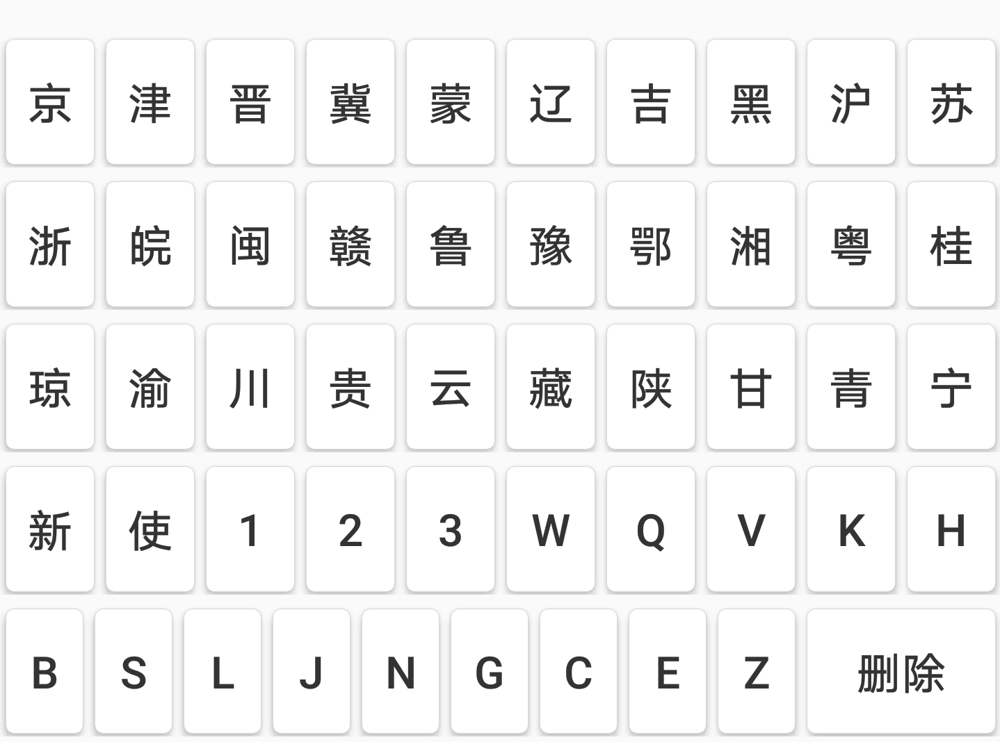

# Keyboard-Android 车牌专用键盘

## 添加依赖

```groovy
    implementation 'com.parkingwang:vehicle-keyboard:0.5.2-ALPHA'
    // OR
    compile 'com.parkingwang:vehicle-keyboard:0.5.2-ALPHA'
```

## 使用组件

### 车牌号码输入组件 InputView


InputView是用于手动输入车牌的组件，提供7-8个用户可选择修改的输入框，如上图所示。

在XML中放置输入组件：

```xml

    <com.parkingwang.vehiclekeyboard.view.InputView
        android:id="@+id/input_view"
        app:pwkInputTextSize="22sp"
        android:layout_width="match_parent"
        android:layout_height="60dp"/>

```

### 车牌号码键盘组件 - KeyboardView



KeyboardView是车牌输入键盘组件，提供按车牌类型显示一定规则的键盘布局供用户点击，如上图所示。

在XML中放置键盘组件：

```xml
    <com.parkingwang.vehiclekeyboard.view.KeyboardView
            android:id="@+id/keyboard"
            android:layout_width="match_parent"
            android:layout_height="wrap_content"
            android:layout_alignParentBottom="true"
            app:pwkKeyboardType="CIVIL"/>
```

### 输入框和键盘控制器 - KeyboardInputController

在代码中绑定输入组件与键盘的关联：

**使用弹出键盘**

详见 MainActivity 的演示代码。

```java
    // Init Views

    // 输入组件View
    mInputView = findViewById(R.id.input_view);
    // 锁定新能源车牌View
    mLockType = findViewById(R.id.lock_type);

    // 创建弹出键盘
    mPopupKeyboard = new PopupKeyboard(this);
    // 弹出键盘内部包含一个KeyboardView，在此绑定输入两者关联。
    mPopupKeyboard.attach(mInputView, this);
    mPopupKeyboard.getKeyboardView()
            .setKeyboardType(KeyboardType.CIVIL_WJ);

    // KeyboardInputController提供一个默认实现的新能源车牌锁定按钮
    mPopupKeyboard.getController()
            .setDebugEnabled(true)
            .bindLockTypeProxy(new KeyboardInputController.ButtonProxyImpl(mLockType) {
                @Override
                public void onNumberTypeChanged(boolean isNewEnergyType) {
                    super.onNumberTypeChanged(isNewEnergyType);
                    if (isNewEnergyType) {
                        mLockType.setTextColor(getResources().getColor(android.R.color.holo_green_light));
                    } else {
                        mLockType.setTextColor(getResources().getColor(android.R.color.black));
                    }
                }
            });


```

**不弹出键盘，直接显示**

```java

// 使用 KeyboardInputController 来关联
mController = KeyboardInputController
                    .with(mKeyboardView, inputView);

mController.useDefaultMessageHandler();

```

## API doc

http://githang.com/private-doc/vehicle-keyboard/

## 其他设置

### 设置键盘按钮文字大小

在Java代码中添加以下设置：
```java
    mKeyboardView.setCNTextSize(float); //设置中文字体大小
    mKeyboardView.setENTextSize(float); //设置英文字母或数字字体大小
```

### 设置确定按键及气泡字体颜色

在colors.xml中覆盖以下颜色值以修改键盘主色
```xml
    <!--确定按键正常状态下的颜色，以及气泡的颜色-->
    <color name="pwk_keyboard_primary_color">#418AF9</color>
    <!--确定按键按下时的颜色-->
    <color name="pwk_keyboard_primary_dark_color">#3A7CE0</color>
```
### 设置输入组件字体大小：

```xml
    <com.parkingwang.vehiclekeyboard.view.InputView
            app:pwkInputTextSize="22sp"
            ..../>
```

### 设置键盘类型

键盘组件支持三种键盘类型：

- `KeyboardType.FULL` 全键盘模式，包括民用、警察、军队、民航、使馆等车牌类型；
- `KeyboardType.CIVIC` 民用车牌键盘；
- `KeyboardType.CIVIL_WJ` 民用车牌+武警车牌类型；

1. 在Java代码中设置

```java
    mKeyboardView.setKeyboardType(KeyboardType.CIVIL_WJ);
```

2. 在XML中设置

```xml
    <com.parkingwang.vehiclekeyboard.view.KeyboardView
            ...
            app:pwkKeyboardType="CIVIL"/>
```

### 设置键盘按下时的气泡：

1. 正确地显示气泡

由于顶层按键的气泡会显示到键盘之外，因此需要键盘所在的父布局增加以下属性（如果气泡范围超出父布局，则需往上递归设置）：
```xml
    android:clipChildren="false"
```

2. 不显示气泡

```java
    mKeyboardView.setShowBubble(false);
```

## 混淆规则 - Proguard

在项目的`proguard-rules.pro`中添加以下混淆规则：

```groguard

# rhino (javascript engine)
-dontwarn org.mozilla.javascript.**
-dontwarn org.mozilla.classfile.**
-keep class org.mozilla.classfile.** { *; }
-keep class org.mozilla.javascript.* { *; }
-keep class org.mozilla.javascript.annotations.** { *; }
-keep class org.mozilla.javascript.ast.** { *; }
-keep class org.mozilla.javascript.commonjs.module.** { *; }
-keep class org.mozilla.javascript.commonjs.module.provider.** { *; }
-keep class org.mozilla.javascript.debug.** { *; }
-keep class org.mozilla.javascript.jdk13.** { *; }
-keep class org.mozilla.javascript.jdk15.** { *; }
-keep class org.mozilla.javascript.json.** { *; }
-keep class org.mozilla.javascript.optimizer.** { *; }
-keep class org.mozilla.javascript.regexp.** { *; }
-keep class org.mozilla.javascript.serialize.** { *; }
-keep class org.mozilla.javascript.typedarrays.** { *; }
-keep class org.mozilla.javascript.v8dtoa.** { *; }
-keep class org.mozilla.javascript.xml.** { *; }
-keep class org.mozilla.javascript.xmlimpl.** { *; }

```